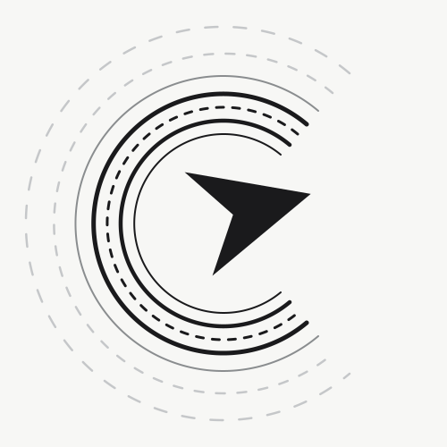

<p align="center">
  <picture>
    <source media="(prefers-color-scheme: dark)" srcset="apps/mobile/assets/branding/recursor_logo_dark.svg">
    
  </picture>
</p>

<h1 align="center">ReCursor</h1>

<p align="center">
  <strong>Mobile-first companion UI for AI coding workflows</strong>
</p>

<p align="center">
  <a href="https://flutter.dev">
    
  </a>
  <a href="https://dart.dev">
    
  </a>
  <a href="https://nodejs.org/">
    
  </a>
  <a href="https://www.typescriptlang.org/">
    
  </a>
  <a href="LICENSE">
    
  </a>
</p>

<p align="center">
  <a href="#project-status">
    
  </a>
  <a href="docs/README.md">
    
  </a>
  <a href="https://github.com/RecursiveDev/ReCursor/issues">
    
  </a>
  <a href="https://github.com/RecursiveDev/ReCursor/pulls">
    
  </a>
  <a href="https://github.com/RecursiveDev/ReCursor/commits/main">
    
  </a>
</p>

<p align="center">
  UI parity with <a href="https://github.com/opencode-ai/opencode">OpenCode</a> • Observability via Claude Code Hooks • Control via Claude Agent SDK
</p>

---

## Project status

This repository is **work in progress**.

- ✅ Repo structure + documentation are being established.
- ✅ The mobile direction is now bridge-first: pair with your local bridge, no sign-in required.
- ⏳ Flutter app and bridge server implementation are still being completed.

If you're new here, start with: **`docs/README.md`** and the bridge pairing flow in `docs/wireframes/01-startup.md`.

---

## What is ReCursor?

**ReCursor** is a Flutter mobile app designed to provide an **OpenCode-like UI/UX on mobile** (tool cards, diffs, session timeline), while integrating with a developer's desktop/local environment.

### Core product intent

- **UI/UX parity goal:** ReCursor's mobile UI should *feel like OpenCode desktop*, adapted for touch and smaller screens.
- **Claude Code integration goal:** Observe and complement a user's Claude Code workflow from mobile.

### Important constraint (Claude Code)

Claude Code's **Remote Control** feature is **first-party only** (designed for `claude.ai/code` and official Claude apps). There is no public API for third-party clients to join or mirror existing Claude Code sessions.

ReCursor's supported integration paths:
- **Claude Code Hooks**: HTTP-based event observation (one-way)
- **Claude Agent SDK**: **parallel, controllable** agent sessions that ReCursor can drive

### Bridge-first, no-login workflow

ReCursor uses a **bridge-first** connection model:
- The mobile app connects directly to a **user-controlled desktop bridge** (no hosted service, no user accounts)
- On startup, the app restores saved bridge pairings or guides through QR-code pairing
- Remote access is achieved via secure tunnels (Tailscale, WireGuard) to the user's own bridge — not through unsupported third-party Claude Remote Control access

---

## Repository layout (scaffold)

```text
C:/Repository/ReCursor/
├── apps/
│   └── mobile/              # Flutter app scaffold (no UI implementation yet)
├── packages/
│   └── bridge/              # Node/TypeScript bridge scaffold (no server logic yet)
├── docs/                    # Source-of-truth project documentation
├── .github/                 # CI/CD scaffolding
└── fastlane/                # Release automation scaffolding
```

---

## Documentation

- **Canonical docs index:** `docs/README.md`
- **Published docs site source:** `docs-site/`
- **Run the docs site locally:** `cd docs-site && npm install && npm run dev`
- **Architecture overview:** `docs/architecture/overview.md`
- **Data flow diagrams:** `docs/architecture/data-flow.md`
- **Integrations:**
  - OpenCode UI patterns: `docs/integration/opencode-ui-patterns.md`
  - Claude Code Hooks: `docs/integration/claude-code-hooks.md`
  - Agent SDK: `docs/integration/agent-sdk.md`

---

## Contributing

See:
- `CONTRIBUTING.md`
- `CODE_OF_CONDUCT.md`
- `SECURITY.md`

If you're using agentic AI to contribute, read **`AGENTS.md`** first.

---

## License

MIT — see `LICENSE`.
