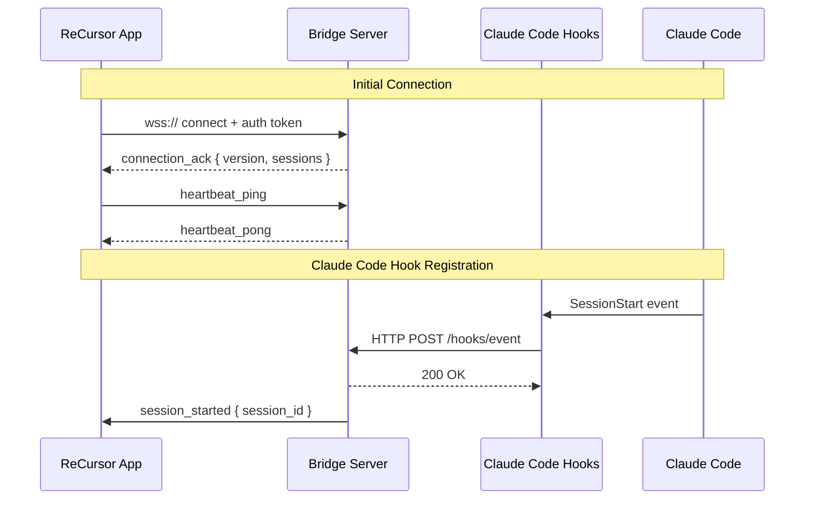

# Bridge Protocol Specification

> WebSocket message protocol between the ReCursor Flutter mobile app and the user-controlled TypeScript bridge server. Bridge-first, no-login: device pairing via QR code, no user accounts.

---

## Connection Lifecycle



---

## Message Format

All messages are JSON objects with a `type` field and an optional `id` for request-response correlation.

```json
{
  "type": "message_type",
  "id": "unique-msg-id",
  "timestamp": "2026-03-16T10:32:00Z",
  "payload": { ... }
}
```

---

## Message Types

### Connection

#### `auth` (client -> server)
Sent immediately after WebSocket connection opens for device pairing authentication.

```json
{
  "type": "auth",
  "id": "auth-001",
  "payload": {
    "token": "device-pairing-token-xxxxx",
    "client_version": "1.0.0",
    "platform": "ios"
  }
}
```

#### `connection_ack` (server -> client)
Confirms authentication and connection. Includes detected connection mode for security transparency.

```json
{
  "type": "connection_ack",
  "id": "auth-001",
  "payload": {
    "server_version": "1.0.0",
    "supported_agents": ["claude-code", "opencode", "aider", "goose"],
    "connection_mode": "secure_remote",
    "connection_mode_description": "Tailscale mesh VPN (100.x.x.x)",
    "bridge_url": "wss://devbox.tailnet.ts.net:3000",
    "requires_health_verification": true,
    "active_sessions": [
      { "session_id": "sess-abc", "agent": "claude-code", "title": "Bridge startup validation" }
    ]
  }
}
```

**Connection Mode Values:**
- `local_only` — Loopback address (127.0.0.1, ::1)
- `private_network` — RFC1918 private IP (10.x, 172.16-31.x, 192.168.x)
- `secure_remote` — Tailscale/WireGuard or validated secure tunnel
- `direct_public` — Public IP/domain without tunnel (requires acknowledgment)
- `misconfigured` — Insecure setup detected (connection will be rejected)

#### `health_check` (client -> server)
Sent after `connection_ack` to verify connection health before entering main shell.

```json
{
  "type": "health_check",
  "id": "health-001",
  "payload": {
    "timestamp": "2026-03-20T14:32:00Z",
    "client_nonce": "random-nonce-123",
    "client_capabilities": ["health_v1", "acknowledgment_v1"]
  }
}
```

#### `health_status` (server -> client)
Response to health check with detailed status and any security warnings.

```json
{
  "type": "health_status",
  "id": "health-001",
  "payload": {
    "status": "healthy",
    "connection_mode": "secure_remote",
    "warnings": [],
    "checks": {
      "tls_valid": true,
      "clock_sync": true,
      "version_compatible": true,
      "token_permissions": true
    },
    "server_timestamp": "2026-03-20T14:32:00.050Z",
    "latency_ms": 24,
    "ready": true
  }
}
```

**Direct Public Remote with Warning:**

```json
{
  "type": "health_status",
  "id": "health-001",
  "payload": {
    "status": "warning",
    "connection_mode": "direct_public",
    "warnings": ["DIRECT_PUBLIC_CONNECTION"],
    "warning_details": {
      "DIRECT_PUBLIC_CONNECTION": "Connection is over public internet without tunnel. Certificate validation is required."
    },
    "checks": {
      "tls_valid": true,
      "clock_sync": true,
      "version_compatible": true,
      "token_permissions": true
    },
    "ready": false,
    "requires_acknowledgment": true
  }
}
```

#### `acknowledge_warning` (client -> server)
User acknowledgment for security warnings (e.g., direct public remote).

```json
{
  "type": "acknowledge_warning",
  "id": "ack-001",
  "payload": {
    "warning_code": "DIRECT_PUBLIC_CONNECTION",
    "acknowledged": true,
    "acknowledged_at": "2026-03-20T14:32:30Z"
  }
}
```

#### `acknowledgment_accepted` (server -> client)
Confirmation that warning acknowledgment was accepted.

```json
{
  "type": "acknowledgment_accepted",
  "id": "ack-001",
  "payload": {
    "warning_code": "DIRECT_PUBLIC_CONNECTION",
    "ready": true,
    "session_timeout": "8h"
  }
}
```

#### `connection_error` (server -> client)
Authentication or connection failure.

```json
{
  "type": "connection_error",
  "id": "auth-001",
  "payload": {
    "code": "AUTH_FAILED",
    "message": "Invalid or expired token"
  }
}
```

**Error Codes:**
- `AUTH_FAILED` — Invalid or expired device pairing token
- `INSECURE_TRANSPORT` — Connection attempted over `ws://` instead of `wss://`
- `MISCONFIGURED` — Bridge security settings prevent this connection
- `VERSION_INCOMPATIBLE` — Client/server protocol version mismatch
- `RATE_LIMITED` — Too many connection attempts

**Misconfigured Mode Example:**

```json
{
  "type": "connection_error",
  "id": "auth-001",
  "payload": {
    "code": "INSECURE_TRANSPORT",
    "message": "Bridge requires wss:// (WebSocket Secure). Unencrypted ws:// connections are blocked.",
    "documentation_url": "https://docs.recursor.dev/security/tls-required",
    "remediation": "Enable TLS on your bridge server and use wss:// URLs"
  }
}
```

#### `heartbeat_ping` / `heartbeat_pong`
Keep-alive messages. Client sends ping, server responds with pong.

```json
{ "type": "heartbeat_ping", "timestamp": "2026-03-16T10:32:00Z" }
{ "type": "heartbeat_pong", "timestamp": "2026-03-16T10:32:00Z" }
```

Interval: 15 seconds (configurable). If no pong received within 10 seconds, client triggers reconnect.

---

### Agent Sessions

#### `session_start` (client -> server)
Start a new agent session or resume an existing one.

```json
{
  "type": "session_start",
  "id": "req-001",
  "payload": {
    "agent": "claude-code",
    "session_id": null,
    "working_directory": "/home/user/project",
    "resume": false
  }
}
```

Set `session_id` and `resume: true` to resume an existing session.

#### `session_ready` (server -> client)
Agent session is initialized and ready.

```json
{
  "type": "session_ready",
  "id": "req-001",
  "payload": {
    "session_id": "sess-abc123",
    "agent": "claude-code",
    "working_directory": "/home/user/project",
    "branch": "main",
    "status": "ready"
  }
}
```

#### `session_end` (bidirectional)
End a session. Can be initiated by client or server.

```json
{
  "type": "session_end",
  "payload": {
    "session_id": "sess-abc123",
    "reason": "user_request" // or "timeout", "error", "completed"
  }
}
```

---

### Chat Messages

#### `message` (client -> server)
Send a chat message to the agent.

```json
{
  "type": "message",
  "id": "msg-001",
  "payload": {
    "session_id": "sess-abc123",
    "content": "Tighten the bridge startup validation in bridge_setup_screen.dart",
    "role": "user"
  }
}
```

#### `stream_start` (server -> client)
Agent begins streaming a response.

```json
{
  "type": "stream_start",
  "payload": {
    "session_id": "sess-abc123",
    "message_id": "msg-resp-001"
  }
}
```

#### `stream_chunk` (server -> client)
Chunk of streamed response content.

```json
{
  "type": "stream_chunk",
  "payload": {
    "session_id": "sess-abc123",
    "message_id": "msg-resp-001",
    "content": "I'll tighten the bridge startup validation",
    "is_tool_use": false
  }
}
```

#### `stream_end` (server -> client)
Streaming response is complete.

```json
{
  "type": "stream_end",
  "payload": {
    "session_id": "sess-abc123",
    "message_id": "msg-resp-001",
    "finish_reason": "stop" // or "tool_call", "length", "error"
  }
}
```

---

### Tool Calls

#### `tool_call` (server -> client)
Agent wants to use a tool. Sent when Agent SDK initiates tool use.

```json
{
  "type": "tool_call",
  "id": "tool-001",
  "payload": {
    "session_id": "sess-abc123",
    "tool_call_id": "call-abc123",
    "tool": "edit_file",
    "params": {
      "file_path": "/home/user/project/lib/features/startup/bridge_setup_screen.dart",
      "old_string": "return wsAllowed(url);",
      "new_string": "return requireWss(url);"
    },
    "description": "Require secure bridge URLs during startup"
  }
}
```

#### `claude_event` (server -> client)
Event from Claude Code Hooks. See [Claude Code Hooks Integration](/integrations/claude-code-hooks/).

```json
{
  "type": "claude_event",
  "payload": {
    "event_type": "PostToolUse",
    "session_id": "sess-abc123",
    "timestamp": "2026-03-16T10:32:00Z",
    "payload": {
      "tool": "edit_file",
      "result": { "success": true }
    }
  }
}
```

#### `approval_required` (server -> client)
Tool call requires user approval (from Hooks or Agent SDK).

```json
{
  "type": "approval_required",
  "id": "tool-001",
  "payload": {
    "session_id": "sess-abc123",
    "tool_call_id": "call-abc123",
    "tool": "run_command",
    "params": {
      "command": "flutter build apk"
    },
    "description": "Build Android APK",
    "risk_level": "medium",
    "source": "hooks" // or "agent_sdk"
  }
}
```

#### `approval_response` (client -> server)
User's decision on a tool call approval.

```json
{
  "type": "approval_response",
  "id": "tool-001",
  "payload": {
    "session_id": "sess-abc123",
    "tool_call_id": "call-abc123",
    "decision": "approved", // or "rejected", "modified"
    "modifications": null // or modified params
  }
}
```

#### `tool_result` (server -> client)
Result of tool execution.

```json
{
  "type": "tool_result",
  "payload": {
    "session_id": "sess-abc123",
    "tool_call_id": "call-abc123",
    "tool": "edit_file",
    "result": {
      "success": true,
      "content": "File edited successfully",
      "diff": "... unified diff ..."
    }
  }
}
```

---

### Git Operations

#### `git_status_request` (client -> server)
Request current git status.

```json
{
  "type": "git_status_request",
  "id": "git-001",
  "payload": {
    "session_id": "sess-abc123"
  }
}
```

#### `git_status_response` (server -> client)
Current git status.

```json
{
  "type": "git_status_response",
  "id": "git-001",
  "payload": {
    "session_id": "sess-abc123",
    "branch": "feature/bridge-startup",
    "ahead": 2,
    "behind": 0,
    "is_clean": false,
    "changes": [
      { "path": "lib/features/startup/bridge_setup_screen.dart", "status": "modified", "additions": 5, "deletions": 2 }
    ]
  }
}
```

#### `git_commit` (client -> server)
Create a commit.

```json
{
  "type": "git_commit",
  "id": "git-002",
  "payload": {
    "session_id": "sess-abc123",
    "message": "Tighten bridge startup validation",
    "files": ["lib/features/startup/bridge_setup_screen.dart"] // null = all staged
  }
}
```

#### `git_diff` (client -> server)
Request diff for files.

```json
{
  "type": "git_diff",
  "id": "git-003",
  "payload": {
    "session_id": "sess-abc123",
    "files": ["lib/features/startup/bridge_setup_screen.dart"], // null = all changes
    "cached": false
  }
}
```

#### `git_diff_response` (server -> client)
Diff content.

```json
{
  "type": "git_diff_response",
  "id": "git-003",
  "payload": {
    "session_id": "sess-abc123",
    "files": [
      {
        "path": "lib/features/startup/bridge_setup_screen.dart",
        "old_path": "lib/features/startup/bridge_setup_screen.dart",
        "new_path": "lib/features/startup/bridge_setup_screen.dart",
        "status": "modified",
        "additions": 5,
        "deletions": 2,
        "hunks": [
          {
            "header": "@@ -10,5 +10,5 @@",
            "old_start": 10,
            "old_lines": 5,
            "new_start": 10,
            "new_lines": 5,
            "lines": [
              { "type": "context", "content": " class BridgeConnectionValidator {" },
              { "type": "removed", "content": "-  return wsAllowed(url);" },
              { "type": "added", "content": "+  return requireWss(url);" },
              { "type": "context", "content": "     // ..." }
            ]
          }
        ]
      }
    ]
  }
}
```

---

### File Operations

#### `file_list` (client -> server)
List files in a directory.

```json
{
  "type": "file_list",
  "id": "file-001",
  "payload": {
    "session_id": "sess-abc123",
    "path": "/home/user/project/lib"
  }
}
```

#### `file_list_response` (server -> client)
Directory listing.

```json
{
  "type": "file_list_response",
  "id": "file-001",
  "payload": {
    "session_id": "sess-abc123",
    "path": "/home/user/project/lib",
    "entries": [
      { "name": "auth.dart", "type": "file", "size": 2048 },
      { "name": "models", "type": "directory" }
    ]
  }
}
```

#### `file_read` (client -> server)
Read file content.

```json
{
  "type": "file_read",
  "id": "file-002",
  "payload": {
    "session_id": "sess-abc123",
    "path": "/home/user/project/lib/features/startup/bridge_setup_screen.dart",
    "offset": 0,
    "limit": 100
  }
}
```

#### `file_read_response` (server -> client)
File content.

```json
{
  "type": "file_read_response",
  "id": "file-002",
  "payload": {
    "session_id": "sess-abc123",
    "path": "/home/user/project/lib/auth.dart",
    "content": "class AuthService { ... }",
    "size": 2048,
    "lines": 45
  }
}
```

---

### Notifications

#### `notification` (server -> client)
Server-initiated notification.

```json
{
  "type": "notification",
  "id": "notif-001",
  "payload": {
    "session_id": "sess-abc123",
    "notification_type": "approval_required",
    "title": "Approval needed: Update bridge_setup_screen.dart",
    "body": "Claude Code wants to tighten bridge URL validation before pairing.",
    "priority": "high",
    "data": {
      "tool_call_id": "tool-001",
      "screen": "approval_detail"
    }
  }
}
```

#### `notification_ack` (client -> server)
Acknowledge receipt of notifications.

```json
{
  "type": "notification_ack",
  "payload": {
    "notification_ids": ["notif-001", "notif-002"]
  }
}
```

---

### Errors

#### `error` (server -> client)
Server-side error.

```json
{
  "type": "error",
  "payload": {
    "code": "AGENT_ERROR",
    "message": "Failed to execute tool: permission denied",
    "session_id": "sess-abc123",
    "recoverable": true
  }
}
```

---

## Error Codes

| Code | Description | Recoverable |
|------|-------------|-------------|
| `AUTH_FAILED` | Invalid or expired token | No (re-auth required) |
| `SESSION_NOT_FOUND` | Session ID doesn't exist | No |
| `AGENT_ERROR` | Agent execution failed | Yes (retry) |
| `TOOL_ERROR` | Tool execution failed | Yes (modify params) |
| `GIT_ERROR` | Git operation failed | Yes |
| `RATE_LIMITED` | Too many requests | Yes (backoff) |
| `BRIDGE_ERROR` | Internal bridge error | Yes |

---

## Reconnection Behavior

When the mobile app reconnects after disconnection:

1. Client sends `auth` message
2. Server responds with `connection_ack` including `active_sessions`
3. Server replays any queued events (notifications, tool results)
4. Client acknowledges with `notification_ack`

---

## Related Documentation

- [Architecture Overview](/architecture/system-overview/) — System architecture
- [Data Flow](/architecture/data-flow/) — Message sequence diagrams
- [Claude Code Hooks Integration](/integrations/claude-code-hooks/) — Hook event format
- [Agent SDK Integration](/integrations/agent-sdk/) — Agent SDK message flow

---

*Last updated: 2026-03-17*
