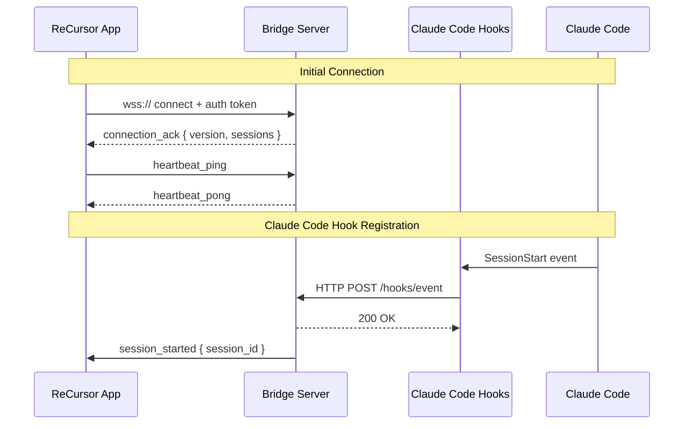
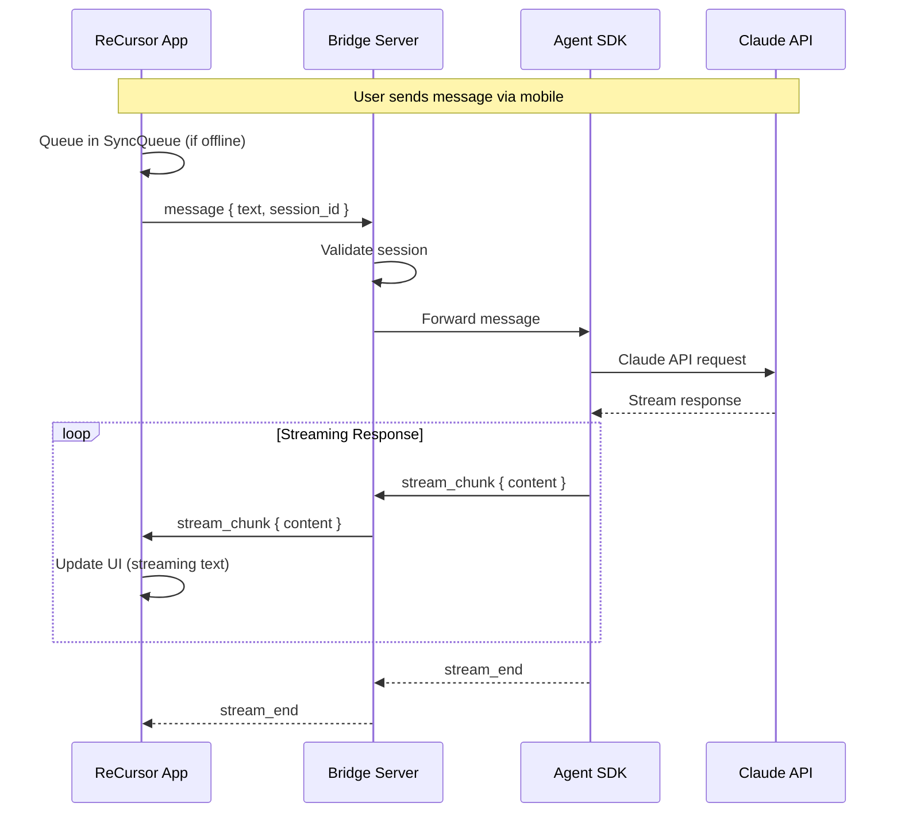
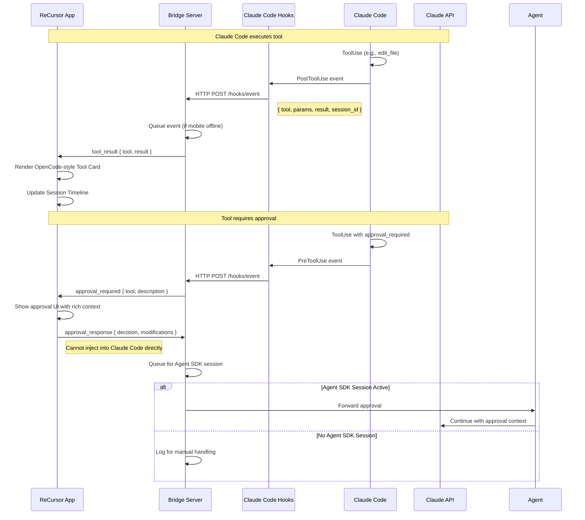
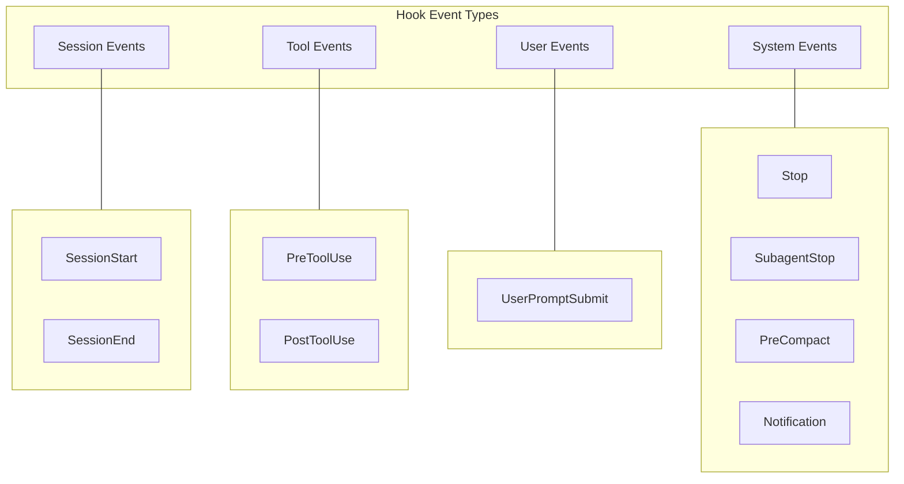
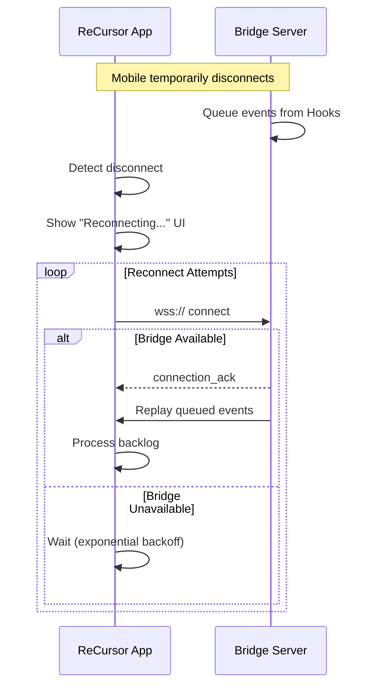
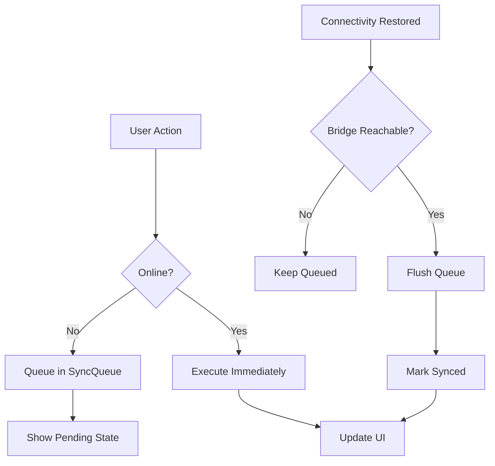

# Data Flow Architecture

> Message flow between ReCursor mobile app, bridge server, and Claude Code via Hooks.

---

## Connection Lifecycle



---

## Message Flow: User Sends Message



---

## Message Flow: Tool Use (via Hooks)



---

## Event Types from Hooks



### Event Mapping to UI

| Hook Event | OpenCode UI Component | Mobile Action |
|------------|----------------------|---------------|
| `SessionStart` | Session timeline | Add session to list |
| `SessionEnd` | Session timeline | Mark session ended |
| `PostToolUse` | Tool card | Render tool result card |
| `PreToolUse` | Approval dialog | Show approval UI |
| `UserPromptSubmit` | Chat message | Show user message |
| `Stop` | Session status | Show completion status |
| `SubagentStop` | Subagent status | Update subagent state |

> **Note**: Only confirmed hook events from Claude Code source truth are listed above. See [Claude Code Hooks Integration](../integrations/claude-code-hooks/) for the complete verified event list.

---

## Reconnection Flow



---

## Offline Queue Flow



---

## Message Format: Hook Events

```json
{
  "event_type": "PostToolUse",
  "session_id": "sess-abc123",
  "timestamp": "2026-03-17T10:32:00Z",
  "payload": {
    "tool": "edit_file",
    "params": {
      "file_path": "/home/user/project/lib/main.dart",
      "old_string": "void main() {",
      "new_string": "void main() async {"
    },
    "result": {
      "success": true,
      "diff": "... unified diff ..."
    },
    "metadata": {
      "token_count": 150,
      "duration_ms": 250
    }
  }
}
```

---

## Message Format: WebSocket Protocol

See [Bridge Protocol](./bridge-protocol/) for complete WebSocket message specification.

---

## Related Documentation

- [Architecture Overview](./system-overview/) — High-level system architecture
- [Claude Code Hooks Integration](../integrations/claude-code-hooks/) — Hook configuration details
- [Agent SDK Integration](../integrations/agent-sdk/) — Parallel session flow
- [Bridge Protocol](./bridge-protocol/) — WebSocket message specification
- [Offline Architecture](../operations/offline-architecture/) — Sync queue implementation

---

*Last updated: 2026-03-17*
