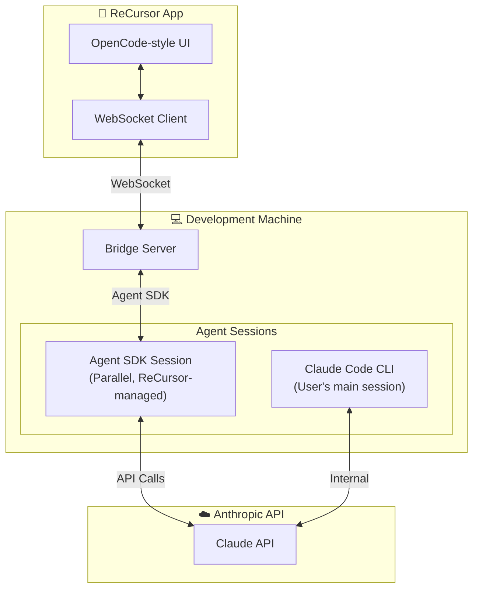
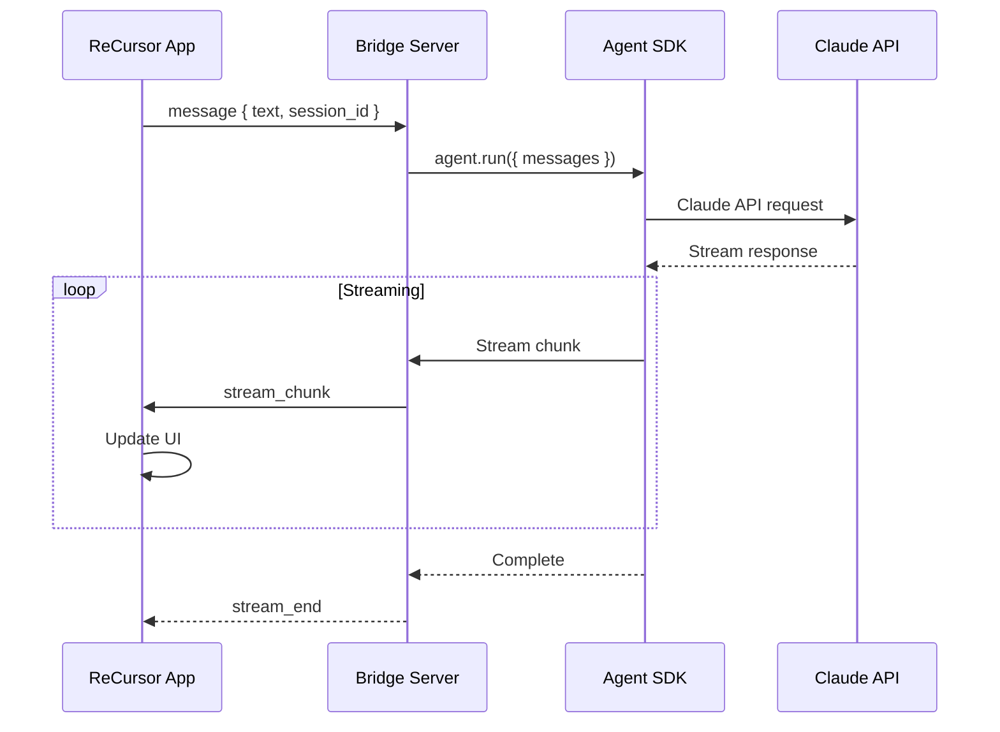
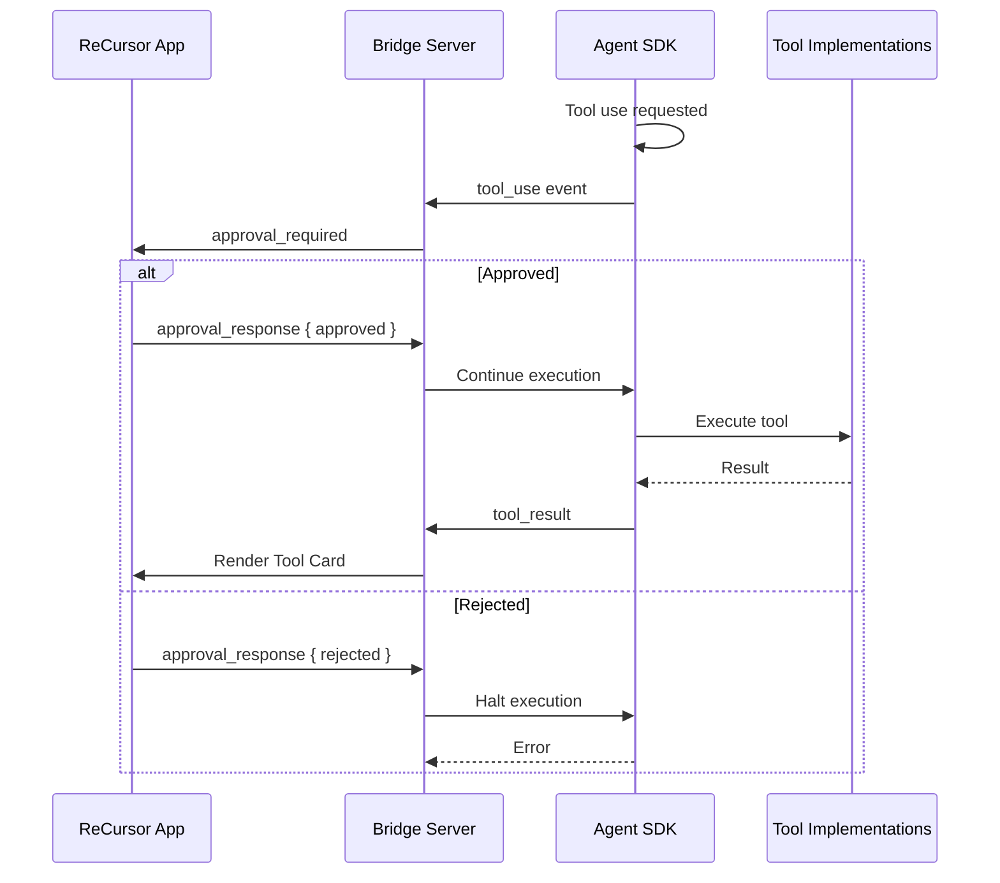

> Using the Claude Agent SDK for parallel agent sessions in ReCursor. This is a supported integration path — ReCursor does not claim to mirror or control existing Claude Code sessions via unsupported Remote Control protocols.

---

## Overview

The **Claude Agent SDK** (`@anthropic-ai/claude-agent-sdk`) is the officially supported way to build agentic applications that interact with Claude. ReCursor uses the Agent SDK to create **parallel agent sessions** that can receive user input from the mobile app and execute tools independently.

> **Key Concept**: Agent SDK sessions are **parallel**, not mirrored. They exist alongside Claude Code sessions rather than controlling them.

---

## Architecture



---

## When to Use Agent SDK

| Scenario | Solution |
|----------|----------|
| User wants to chat with agent from mobile | ✅ Agent SDK session |
| User wants to approve tool calls from mobile | ⚠️ Hooks + Agent SDK (see below) |
| User wants to see what Claude Code is doing | ✅ Hooks |
| User wants to control existing Claude Code session | ❌ Not supported (Remote Control is first-party only) |

### Hybrid Approach

For full functionality, ReCursor uses both:

1. **Hooks** — Observe Claude Code events (tool use, session state)
2. **Agent SDK** — Receive user input and execute independent actions

When a user "approves" a tool call in the mobile app:
- The approval is sent to the Agent SDK session
- The Agent SDK session executes a similar tool
- Claude Code continues independently (Hooks show what it did)

---

## Agent SDK Setup

### Installation

```bash
npm install @anthropic-ai/claude-agent-sdk
```

### Basic Session

```typescript
import { Agent } from '@anthropic-ai/claude-agent-sdk';
import { ReadTool, EditTool, BashTool } from '@anthropic-ai/claude-agent-sdk/tools';

const agent = new Agent({
  model: 'claude-3-5-sonnet-20241022',
  tools: [new ReadTool(), new EditTool(), new BashTool()],
  workingDirectory: '/home/user/project',
});

// Start a conversation
const response = await agent.run({
  messages: [{ role: 'user', content: 'Tighten the bridge startup validation in bridge_setup_screen.dart' }],
});
```

### Integration with Bridge Server

```typescript
// Bridge server manages Agent SDK sessions
import { Agent } from '@anthropic-ai/claude-agent-sdk';
import { EventEmitter } from 'events';

class AgentSessionManager {
  private sessions: Map<string, Agent> = new Map();
  private eventEmitter: EventEmitter = new EventEmitter();

  async createSession(sessionId: string, config: SessionConfig): Promise<void> {
    const agent = new Agent({
      model: config.model || 'claude-3-5-sonnet-20241022',
      tools: this.loadTools(config.toolAllowlist),
      workingDirectory: config.workingDirectory,
    });

    this.sessions.set(sessionId, agent);
    
    // Forward events to mobile
    agent.on('tool_use', (event) => {
      this.eventEmitter.emit('tool-use', { sessionId, event });
    });

    agent.on('message', (event) => {
      this.eventEmitter.emit('message', { sessionId, event });
    });
  }

  async sendMessage(sessionId: string, message: string): Promise<void> {
    const agent = this.sessions.get(sessionId);
    if (!agent) throw new Error('Session not found');

    // Stream response back to mobile
    const stream = agent.run({
      messages: [{ role: 'user', content: message }],
    });

    for await (const chunk of stream) {
      this.eventEmitter.emit('stream_chunk', { sessionId, chunk });
    }
  }

  async executeTool(sessionId: string, toolCall: ToolCall): Promise<ToolResult> {
    const agent = this.sessions.get(sessionId);
    if (!agent) throw new Error('Session not found');

    return agent.executeTool(toolCall);
  }
}
```

---

## Message Flow

### User Sends Message



### Tool Execution



---

## Tool Configuration

### Available Tools

```typescript
import {
  ReadTool,
  EditTool,
  BashTool,
  GlobTool,
  GrepTool,
  LSTool,
} from '@anthropic-ai/claude-agent-sdk/tools';

const tools = [
  new ReadTool(),      // Read file contents
  new EditTool(),      // Edit files (find/replace)
  new BashTool({      // Execute shell commands
    allowedCommands: ['git', 'flutter', 'npm'], // Optional allowlist
  }),
  new GlobTool(),      // File globbing
  new GrepTool(),      // Text search
  new LSTool(),        // List directory contents
];
```

### Custom Tools

```typescript
import { Tool, ToolInput, ToolResult } from '@anthropic-ai/claude-agent-sdk';

class DeployTool implements Tool {
  name = 'deploy_app';
  description = 'Deploy the application to staging/production';
  
  async execute(input: ToolInput): Promise<ToolResult> {
    const { environment, version } = input.parameters;
    
    // Custom deployment logic
    const result = await this.deploy(environment, version);
    
    return {
      success: result.success,
      content: result.message,
    };
  }
}
```

---

## Session Management

### Session Lifecycle

```typescript
interface SessionLifecycle {
  // Create new session
  async createSession(config: SessionConfig): Promise<string>;
  
  // Resume existing session (if supported)
  async resumeSession(sessionId: string): Promise<void>;
  
  // Pause (keep context, stop processing)
  async pauseSession(sessionId: string): Promise<void>;
  
  // Close (cleanup resources)
  async closeSession(sessionId: string): Promise<void>;
}
```

### Session Context

```typescript
interface SessionContext {
  sessionId: string;
  workingDirectory: string;
  gitBranch?: string;
  toolAllowlist: string[];
  model: string;
  temperature: number;
  
  // Conversation history (for resuming)
  messageHistory: Message[];
}
```

---

## Configuration

### Environment Variables

```bash
# Bridge server .env
ANTHROPIC_API_KEY=sk-ant-...
AGENT_MODEL=claude-3-5-sonnet-20241022
AGENT_MAX_ITERATIONS=25
AGENT_TEMPERATURE=0.7
```

### Per-Session Configuration

```typescript
interface SessionConfig {
  model?: string;
  temperature?: number;
  maxIterations?: number;
  toolAllowlist?: string[];
  workingDirectory: string;
  initialInstructions?: string;
}
```

---

## Error Handling

### Common Errors

| Error | Cause | Solution |
|-------|-------|----------|
| `APIError` | Invalid API key or rate limit | Check API key, implement backoff |
| `ToolError` | Tool execution failed | Show error in tool card |
| `TimeoutError` | Tool took too long | Set appropriate timeouts |
| `SessionError` | Session ID not found | Validate session on mobile |

### Retry Strategy

```typescript
async function withRetry<T>(
  operation: () => Promise<T>,
  maxRetries: number = 3
): Promise<T> {
  for (let i = 0; i < maxRetries; i++) {
    try {
      return await operation();
    } catch (error) {
      if (i === maxRetries - 1) throw error;
      await delay(Math.pow(2, i) * 1000); // Exponential backoff
    }
  }
  throw new Error('Unreachable');
}
```

---

## Security Considerations

### API Key Management

- Store `ANTHROPIC_API_KEY` in bridge server environment only
- Never expose to mobile app
- Rotate keys regularly

### Tool Restrictions

```typescript
// Restrict dangerous tools
const safeTools = [
  new ReadTool(),
  new EditTool(),
  new BashTool({
    allowedCommands: ['git', 'flutter', 'npm'],
    blockedCommands: ['rm -rf', 'sudo', 'chmod'],
  }),
];
```

### Working Directory Isolation

```typescript
// Verify working directory is within allowed paths
function validateWorkingDirectory(dir: string): void {
  const allowedRoot = process.env.ALLOWED_PROJECT_ROOT;
  if (!dir.startsWith(allowedRoot)) {
    throw new Error('Working directory outside allowed root');
  }
}
```

---

## Related Documentation

- [Claude Code Hooks Integration](../claude-code-hooks/) — Event observation
- [Architecture Overview](../../architecture/system-overview/) — System architecture
- [Data Flow](../../architecture/data-flow/) — Message sequence diagrams
- [Bridge Protocol](../../architecture/bridge-protocol/) — WebSocket message specification

---

*Last updated: 2026-03-17*
