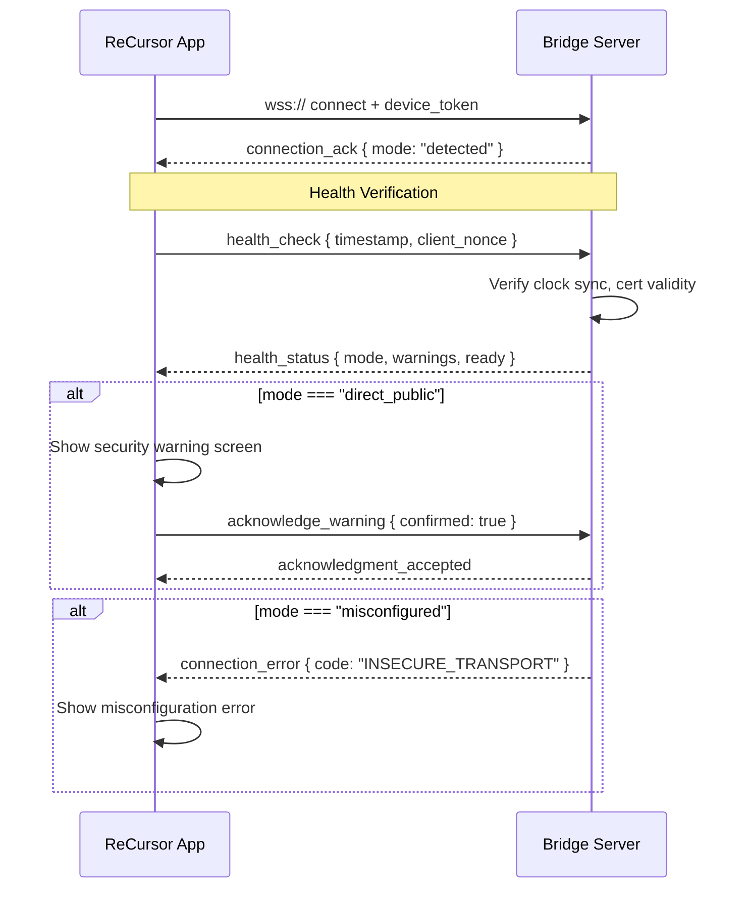
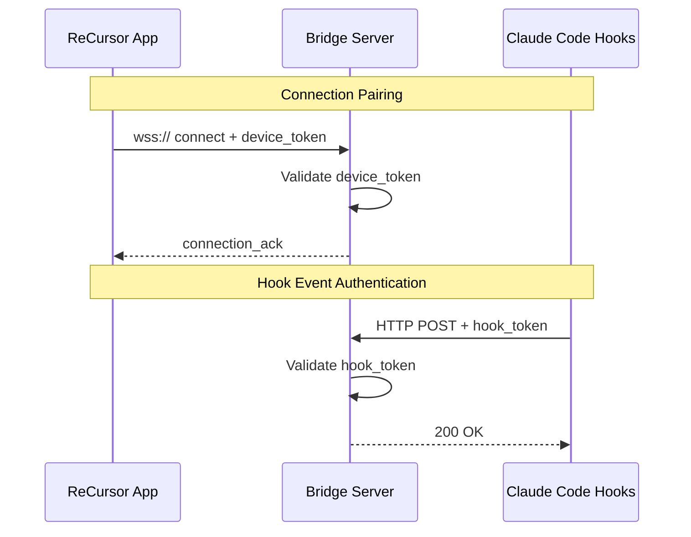

> Best practices for securing the WebSocket bridge between the ReCursor mobile app and the coding agent.

---

## Network Layer

- **Use a secure tunnel for remote access.** Tailscale (recommended) wraps WireGuard encryption, handles NAT traversal, and creates a zero-config mesh VPN between phone and dev machine. DERP relay servers never see unencrypted data. Other options include WireGuard, Cloudflare Tunnel, or SSH tunneling.
- **Always use `wss://` (WebSocket Secure).** TLS at the application layer + tunnel encryption at the network layer = defense in depth.
- **Never expose the bridge on a public IP without tunnel protection.** The bridge should only be reachable within your secure tunnel network.

## Connection Mode Security

ReCursor detects and categorizes bridge connections into five modes, each with distinct security boundaries and user experience:

| Mode | Trust Boundary | Risk Level | Mitigation |
|------|---------------|------------|------------|
| **Local-only** | Same device (loopback) | Minimal | Standard TLS + token auth |
| **Private network** | LAN/VPN (RFC1918) | Low | Network isolation + TLS + token |
| **Secure remote** | Tailscale/WireGuard mesh | Low | WireGuard encryption + TLS + token |
| **Direct public remote** | Public internet | High | Certificate pinning, user acknowledgment, optional IP allowlist |
| **Misconfigured** | Insecure transport | Critical | **Connection blocked** |

### Mode Detection Logic

The bridge analyzes the incoming connection to determine the mode:

```typescript
function detectConnectionMode(remoteAddress: string, protocol: string): ConnectionMode {
  // Block insecure transport
  if (protocol === 'ws:') return 'misconfigured';
  
  // Local-only
  if (isLoopback(remoteAddress)) return 'local_only';
  
  // Private network
  if (isPrivateIP(remoteAddress)) return 'private_network';
  
  // Secure remote (Tailscale/WireGuard)
  if (isTailscaleIP(remoteAddress) || isWireGuardIP(remoteAddress)) return 'secure_remote';
  
  // Default to direct public with warning
  return 'direct_public';
}
```

### Health Verification Protocol

After WebSocket authentication, the client must complete health verification before accessing the main shell:



### Security Warnings for Direct Public Remote

When connecting directly to a public IP without a tunnel:

1. **Certificate validation** is mandatory (no self-signed certs)
2. **User acknowledgment** is required before proceeding
3. **Visual indicator** shows warning state (yellow triangle)
4. **Optional**: Bridge can require IP allowlist for additional protection

```typescript
// Bridge configuration for public access
const PUBLIC_ACCESS_CONFIG = {
  requireCertificatePinning: true,
  requireUserAcknowledgment: true,
  allowedIPs: ['203.0.113.0/24'], // Optional allowlist
  maxSessionDuration: '8h', // Optional session limits
};
```

### Misconfigured Mode Blocking

Connections are **rejected** (not just warned) for:
- `ws://` instead of `wss://` (unencrypted transport)
- Missing or invalid TLS certificate
- Token transmitted over insecure channel

```json
{
  "type": "connection_error",
  "payload": {
    "code": "INSECURE_TRANSPORT",
    "message": "Bridge requires wss:// (WebSocket Secure). Unencrypted ws:// connections are blocked.",
    "documentation_url": "https://docs.recursor.dev/security/tls-required"
  }
}
```

---

## Bridge Connection Security



### Token Types

| Token Type | Purpose | Storage |
|------------|---------|---------|
| Device Pairing Token | Authenticate mobile app to bridge (generated at pairing) | `flutter_secure_storage` |
| Hook Token | Authenticate Claude Code Hooks to bridge | Bridge server env only |

---

## Token Management

### Device Pairing Token

- **Generate**: 32+ character random string (crypto-safe), generated during bridge setup
- **Storage**: Bridge server environment variable or config file
- **Mobile**: Encrypted with `flutter_secure_storage` (Keychain/EncryptedSharedPreferences)
- **QR Code**: Bridge URL + token encoded for easy pairing
- **No User Accounts**: Tokens are per-device, not tied to any user identity or hosted account
- **Bridge-First**: No login flow — the app opens to bridge pairing/restore, not sign-in

```dart
// Token generation (bridge server)
import crypto from 'crypto';
const token = crypto.randomBytes(32).toString('hex'); // 64 chars
```

### Token Rotation

- Rotate device tokens if bridge is reinstalled or security concern arises
- Clear token from mobile app via "Disconnect Bridge" in Settings
- Support token revocation list on bridge server

---

## Certificate Pinning

Flutter supports SSL pinning via `SecurityContext` with certificate chain files from assets.

```dart
// Certificate pinning setup
Future<SecurityContext> getSecureContext() async {
  final context = SecurityContext(withTrustedRoots: false);
  
  // Load pinned certificate
  final cert = await rootBundle.load('assets/certs/bridge.crt');
  context.setTrustedCertificatesBytes(cert.buffer.asUint8List());
  
  return context;
}

// Use with WebSocket
final channel = IOWebSocketChannel.connect(
  'wss://100.78.42.15:3000',
  customClient: HttpClient(context: await getSecureContext()),
);
```

**Pin the public key**, not the certificate itself — more resilient to cert renewals.

Maintain backup pins per OWASP guidance to prevent app breakage.

---

## Bridge Authorization

The bridge server is the security boundary — it must enforce its own authorization layer.

- **Allowlist of permitted operations** (e.g., file read yes, `rm -rf /` no)
- **Enforce working directory boundaries** — the agent should only access the project directory
- **Log all commands** sent through the bridge for audit
- **Separate bridge auth from agent auth** — compromising one shouldn't compromise the other

### Working Directory Isolation

```typescript
// Bridge server authorization
function validateWorkingDirectory(
  requestedPath: string,
  allowedRoot: string
): boolean {
  const resolved = path.resolve(requestedPath);
  const root = path.resolve(allowedRoot);
  return resolved.startsWith(root);
}
```

### Operation Allowlist

```typescript
const ALLOWED_TOOLS = [
  'read_file',
  'edit_file',
  'glob',
  'grep',
  'ls',
];

const BLOCKED_COMMANDS = [
  'rm -rf /',
  'sudo',
  'chmod 777',
];
```

---

## Data in Transit

- All WebSocket messages should be JSON with a defined schema
- Sensitive data (tokens, keys found in code) should be flagged and optionally redacted in transit
- Consider message signing (HMAC) for critical operations (git push, file delete) as an additional integrity check

### Payload Sanitization

```typescript
// Redact sensitive patterns from responses
function sanitizePayload(payload: unknown): unknown {
  const sensitivePatterns = [
    /[a-zA-Z0-9_-]{20,}\.[_a-zA-Z0-9]{10,}/g, // API keys
    /ghp_[a-zA-Z0-9]{36}/g, // GitHub tokens
    /sk-[a-zA-Z0-9]{48}/g, // Anthropic keys
  ];
  
  const json = JSON.stringify(payload);
  let sanitized = json;
  
  for (const pattern of sensitivePatterns) {
    sanitized = sanitized.replace(pattern, '[REDACTED]');
  }
  
  return JSON.parse(sanitized);
}
```

---

## Claude Code Hooks Security

### Hook Endpoint Authentication

```typescript
// Bridge server hook endpoint
app.post('/hooks/event', (req, res) => {
  const token = req.headers.authorization?.replace('Bearer ', '');
  
  if (!verifyHookToken(token)) {
    return res.status(401).json({ error: 'Unauthorized' });
  }
  
  // Process event
});
```

### Event Validation

```typescript
function validateHookEvent(event: unknown): boolean {
  // Validate structure
  // Validate timestamp (not too old)
  // Validate signature (if using HMAC)
  return true;
}
```

---

## Security Checklist

### Development

- [ ] Never commit secrets to repository
- [ ] Use `.env` files for local configuration (not committed)
- [ ] Run `flutter analyze` security lints
- [ ] Use Snyk or similar for dependency scanning

### Deployment

- [ ] Generate unique bridge auth tokens per user/device
- [ ] Enable TLS 1.3 on bridge server
- [ ] Configure Tailscale ACLs (access control lists)
- [ ] Set up intrusion detection on bridge server
- [ ] Enable audit logging

### Mobile App

- [ ] Use `flutter_secure_storage` for all tokens
- [ ] Implement certificate pinning
- [ ] Support biometric unlock for sensitive operations
- [ ] Clear sensitive data on app background

---

## Threat Model

| Threat | Likelihood | Impact | Mitigation |
|--------|------------|--------|------------|
| Token theft | Medium | High | Secure storage, rotation, short expiry |
| Man-in-the-middle | Low | High | TLS + certificate pinning |
| Bridge compromise | Low | Critical | Working directory isolation, operation allowlist |
| Replay attacks | Low | Medium | Timestamp validation, nonce |
| Social engineering | Medium | Medium | Out-of-band confirmation for destructive ops |
| Connection mode spoofing | Low | High | Server-side detection, client verification of mode |
| DNS hijacking (public remote) | Medium | High | Certificate pinning, DNSSEC where available |
| Downgrade to ws:// | Low | Critical | **Block all ws:// connections**, HSTS-like enforcement |

---

## TLS/Certificate Trust Implementation

This section provides concrete implementation guidance for TLS certificate management in ReCursor, grounded in patterns from remote-claude and code-server benchmarks.

### Self-Signed Certificate Generation

For private networks (Tailscale, WireGuard, LAN), self-signed certificates are acceptable and often necessary. The bridge server can auto-generate certificates on first startup.

#### Certificate Generation Script

```bash
#!/bin/bash
# scripts/generate-cert.sh

CERT_DIR="${CERT_DIR:-./certs}"
mkdir -p "$CERT_DIR"

# Detect Tailscale IP for SAN
TAILSCALE_IP=$(tailscale ip -4 2>/dev/null || echo "")
HOSTNAME=$(hostname)

# Build subjectAltName
SAN="DNS:localhost,DNS:$HOSTNAME,IP:127.0.0.1,IP:::1"
[ -n "$TAILSCALE_IP" ] && SAN="$SAN,IP:$TAILSCALE_IP"

# Generate private key and certificate
openssl req -x509 -newkey rsa:2048 \
  -keyout "$CERT_DIR/key.pem" \
  -out "$CERT_DIR/cert.pem" \
  -days 365 \
  -nodes \
  -subj "/CN=recursor-bridge/O=ReCursor" \
  -addext "subjectAltName=$SAN"

echo "Certificate generated:"
echo "  Certificate: $CERT_DIR/cert.pem"
echo "  Key: $CERT_DIR/key.pem"
[ -n "$TAILSCALE_IP" ] && echo "  Tailscale IP: $TAILSCALE_IP"
```

#### Programmatic Generation (Node.js)

```typescript
import * as forge from 'node-forge';
import * as fs from 'fs';
import * as path from 'path';
import { networkInterfaces } from 'os';

interface CertificateConfig {
  certDir: string;
  validityDays: number;
  keySize: number;
}

interface GeneratedCertificate {
  certPath: string;
  keyPath: string;
  fingerprint: string;
  expiresAt: Date;
}

export async function generateSelfSignedCertificate(
  config: CertificateConfig
): Promise<GeneratedCertificate> {
  const { certDir, validityDays, keySize } = config;
  
  // Ensure cert directory exists
  await fs.promises.mkdir(certDir, { recursive: true });
  
  // Generate key pair
  const { privateKey, publicKey } = forge.pki.rsa.generateKeyPair(keySize);
  
  // Create certificate
  const cert = forge.pki.createCertificate();
  cert.publicKey = publicKey;
  cert.serialNumber = '01';
  cert.validity.notBefore = new Date();
  cert.validity.notAfter = new Date();
  cert.validity.notAfter.setDate(cert.validity.notBefore.getDate() + validityDays);
  
  // Subject attributes
  const attrs = [
    { name: 'commonName', value: 'recursor-bridge' },
    { name: 'organizationName', value: 'ReCursor' },
  ];
  cert.setSubject(attrs);
  cert.setIssuer(attrs);
  
  // Subject Alternative Names
  const sanIPs = getLocalIPs();
  const extensions = [
    {
      name: 'subjectAltName',
      altNames: [
        { type: 2, value: 'localhost' },
        { type: 7, ip: '127.0.0.1' },
        { type: 7, ip: '::1' },
        ...sanIPs.map(ip => ({ type: 7, ip })),
      ],
    },
    {
      name: 'keyUsage',
      keyCertSign: true,
      digitalSignature: true,
      nonRepudiation: true,
      keyEncipherment: true,
      dataEncipherment: true,
    },
    {
      name: 'extKeyUsage',
      serverAuth: true,
    },
  ];
  cert.setExtensions(extensions);
  
  // Self-sign
  cert.sign(privateKey, forge.md.sha256.create());
  
  // Convert to PEM
  const certPem = forge.pki.certificateToPem(cert);
  const keyPem = forge.pki.privateKeyToPem(privateKey);
  
  // Write to files
  const certPath = path.join(certDir, 'cert.pem');
  const keyPath = path.join(certDir, 'key.pem');
  
  await fs.promises.writeFile(certPath, certPem);
  await fs.promises.writeFile(keyPath, keyPem, { mode: 0o600 }); // Restrict permissions
  
  // Calculate fingerprint
  const fingerprint = forge.md.sha1
    .create()
    .update(forge.asn1.toDer(forge.pki.certificateToAsn1(cert)).getBytes())
    .digest()
    .toHex()
    .match(/.{2}/g)!
    .join(':')
    .toUpperCase();
  
  return {
    certPath,
    keyPath,
    fingerprint,
    expiresAt: cert.validity.notAfter,
  };
}

function getLocalIPs(): string[] {
  const interfaces = networkInterfaces();
  const ips: string[] = [];
  
  for (const name of Object.keys(interfaces)) {
    for (const iface of interfaces[name] || []) {
      // Include internal IPs for Tailscale/WireGuard
      if (iface.family === 'IPv4' && !iface.internal) {
        ips.push(iface.address);
      }
      // Include Tailscale IPs (100.x.x.x range)
      if (iface.address.startsWith('100.')) {
        ips.push(iface.address);
      }
    }
  }
  
  return [...new Set(ips)];
}
```

### Certificate Pinning Hash

Generate a pinning hash for mobile app inclusion:

```typescript
import * as crypto from 'crypto';
import * as fs from 'fs';

export function getCertificatePinningHash(certPath: string): string {
  const certPem = fs.readFileSync(certPath, 'utf-8');
  const cert = certPem
    .replace(/-----BEGIN CERTIFICATE-----\n/, '')
    .replace(/\n-----END CERTIFICATE-----/, '')
    .replace(/\n/g, '');
  
  const certBuffer = Buffer.from(cert, 'base64');
  const hash = crypto.createHash('sha256').update(certBuffer).digest('base64');
  
  return `sha256/${hash}`;
}

// Usage
const pinHash = getCertificatePinningHash('./certs/cert.pem');
console.log(`Pinning hash: ${pinHash}`);
```

### Mobile Platform TLS Caveats

#### iOS Specifics

```dart
import 'dart:io';
import 'package:flutter/services.dart';

class IOSCertificateTrust {
  /// iOS requires ATS (App Transport Security) exceptions for self-signed certs
  /// 
  /// Add to ios/Runner/Info.plist:
  /// <key>NSAppTransportSecurity</key>
  /// <dict>
  ///   <key>NSExceptionDomains</key>
  ///   <dict>
  ///     <key>100.x.x.x</key> <!-- Your Tailscale IP -->
  ///     <dict>
  ///       <key>NSExceptionAllowsInsecureHTTPLoads</key>
  ///       <false/>
  ///       <key>NSExceptionMinimumTLSVersion</key>
  ///       <string>TLSv1.3</string>
  ///       <key>NSTemporaryExceptionAllowsInsecureHTTPLoads</key>
  ///       <false/>
  ///     </dict>
  ///   </dict>
  /// </dict>
  
  static Future<SecurityContext> getSecureContext() async {
    final context = SecurityContext(withTrustedRoots: true);
    
    // Load pinned certificate
    final certData = await rootBundle.load('assets/certs/bridge.crt');
    context.setTrustedCertificatesBytes(certData.buffer.asUint8List());
    
    // iOS 13+ requires TLS 1.3 or 1.2 minimum
    // This is enforced by the SecurityContext default
    
    return context;
  }
}
```

**Info.plist Configuration:**

```xml
<key>NSAppTransportSecurity</key>
<dict>
  <key>NSAllowsArbitraryLoads</key>
  <false/>
  <key>NSExceptionDomains</key>
  <dict>
    <key>tailscale-device.tailnet.ts.net</key>
    <dict>
      <key>NSExceptionMinimumTLSVersion</key>
      <string>TLSv1.2</string>
      <key>NSExceptionRequiresForwardSecrecy</key>
      <true/>
    </dict>
  </dict>
</dict>
```

#### Android Specifics

```dart
import 'dart:io';
import 'package:flutter/services.dart';

class AndroidCertificateTrust {
  /// Android 7+ (API 24+) uses Network Security Config for certificate trust
  /// 
  /// Add to android/app/src/main/res/xml/network_security_config.xml:
  /// <?xml version="1.0" encoding="utf-8"?>
  /// <network-security-config>
  ///   <domain-config>
  ///     <domain includeSubdomains="true">100.x.x.x</domain>
  ///     <trust-anchors>
  ///       <certificates src="@raw/bridge_cert"/>
  ///     </trust-anchors>
  ///   </domain-config>
  /// </network-security-config>
  /// 
  /// Reference in AndroidManifest.xml:
  /// <application 
  ///   android:networkSecurityConfig="@xml/network_security_config"
  ///   ...>
  
  static Future<SecurityContext> getSecureContext() async {
    final context = SecurityContext(withTrustedRoots: true);
    
    // Android accepts custom trust anchors via SecurityContext
    final certData = await rootBundle.load('assets/certs/bridge.crt');
    context.setTrustedCertificatesBytes(certData.buffer.asUint8List());
    
    return context;
  }
}
```

**network_security_config.xml:**

```xml
<?xml version="1.0" encoding="utf-8"?>
<network-security-config>
  <!-- Domain config for Tailscale/WireGuard IPs -->
  <domain-config cleartextTrafficPermitted="false">
    <domain includeSubdomains="false">100.64.0.0</domain>
    <trust-anchors>
      <certificates src="@raw/bridge_cert"/>
      <certificates src="system"/>
    </trust-anchors>
  </domain-config>
  
  <!-- Debug configuration (remove for release) -->
  <debug-overrides>
    <trust-anchors>
      <certificates src="user"/>
    </trust-anchors>
  </debug-overrides>
</network-security-config>
```

#### Flutter Certificate Validation

```dart
import 'dart:io';
import 'package:flutter/services.dart';

class BridgeCertificateValidator {
  static String? _pinnedHash;
  
  /// Initialize with certificate pinning hash
  static Future<void> initialize() async {
    // Load from secure config or build-time asset
    _pinnedHash = await _loadPinningHash();
  }
  
  /// Custom certificate validation callback
  static bool validateCertificate(
    X509Certificate certificate,
    String host,
    int port,
  ) {
    if (_pinnedHash == null) return true; // Pinning not configured
    
    final certHash = _computePinningHash(certificate);
    if (certHash != _pinnedHash) {
      // Certificate doesn't match pin
      // Log security event
      return false;
    }
    
    return true;
  }
  
  static String _computePinningHash(X509Certificate cert) {
    // Compute SHA-256 of certificate SPKI
    final data = cert.der;
    // Hash computation...
    return 'sha256/${base64Encode(sha256.convert(data).bytes)}';
  }
  
  static Future<String?> _loadPinningHash() async {
    try {
      final hash = await rootBundle.loadString('assets/certs/pinning_hash.txt');
      return hash.trim();
    } catch (e) {
      return null;
    }
  }
}
```

### Certificate Rotation Strategy

```typescript
// Bridge server certificate management
interface CertificateRotation {
  activeCert: Certificate;
  nextCert?: Certificate;      // Pre-generated, will activate soon
  previousCert?: Certificate;    // Previous, still valid for grace period
  gracePeriodDays: number;
}

class CertificateManager {
  private rotation: CertificateRotation;
  
  async rotateCertificate(): Promise<void> {
    // Generate new certificate
    const newCert = await generateSelfSignedCertificate({
      certDir: './certs',
      validityDays: 365,
      keySize: 2048,
    });
    
    // Stage as next certificate
    this.rotation.nextCert = newCert;
    
    // Notify connected clients of upcoming rotation
    this.broadcastToClients({
      type: 'certificate_rotation_scheduled',
      payload: {
        newFingerprint: newCert.fingerprint,
        effectiveDate: Date.now() + 24 * 60 * 60 * 1000, // 24 hours
      },
    });
  }
  
  async activateRotatedCertificate(): Promise<void> {
    if (!this.rotation.nextCert) {
      throw new Error('No staged certificate available');
    }
    
    // Move current to previous
    this.rotation.previousCert = this.rotation.activeCert;
    
    // Activate new certificate
    this.rotation.activeCert = this.rotation.nextCert;
    this.rotation.nextCert = undefined;
    
    // Server will use new cert for new connections
    // Old connections remain valid until closed
  }
}
```

### Trust On First Use (TOFU)

For development scenarios, implement TOFU pattern:

```dart
class TOFUTrustManager {
  static const String _prefsKey = 'bridge_cert_fingerprint';
  
  /// Check certificate against stored fingerprint
  static Future<bool> verifyOrTrustCertificate(
    X509Certificate certificate,
    String host,
  ) async {
    final currentFingerprint = _computeFingerprint(certificate);
    final storedFingerprint = await _getStoredFingerprint();
    
    if (storedFingerprint == null) {
      // First time seeing this certificate - trust it
      await _storeFingerprint(currentFingerprint);
      return true;
    }
    
    if (storedFingerprint != currentFingerprint) {
      // Certificate changed!
      return false; // Trigger user confirmation
    }
    
    return true;
  }
  
  static Future<void> clearStoredFingerprint() async {
    final prefs = await SharedPreferences.getInstance();
    await prefs.remove(_prefsKey);
  }
  
  static String _computeFingerprint(X509Certificate cert) {
    // SHA-256 of certificate
  }
  
  static Future<String?> _getStoredFingerprint() async {
    final prefs = await SharedPreferences.getInstance();
    return prefs.getString(_prefsKey);
  }
  
  static Future<void> _storeFingerprint(String fingerprint) async {
    final prefs = await SharedPreferences.getInstance();
    await prefs.setString(_prefsKey, fingerprint);
  }
}
```

---

## Related Documentation

- [Architecture Overview](../architecture/system-overview/) — System architecture
- [Bridge Protocol](../architecture/bridge-protocol/) — WebSocket specification
- [Bridge HTTP API](../reference/bridge-http-api/) — HTTP endpoints specification
- [Claude Code Hooks Integration](../integrations/claude-code-hooks/) — Hook security
- [Agent SDK Integration](../integrations/agent-sdk/) — Agent SDK security
- [Error Handling](../reference/error-handling/) — Error codes and recovery

---

*Last updated: 2026-03-20*
