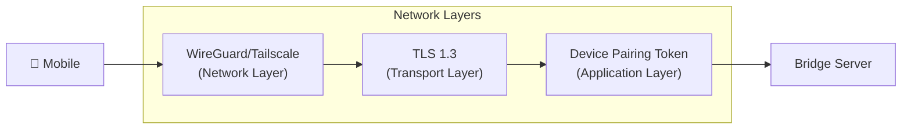

# Architecture Overview

> System architecture for ReCursor: a Flutter mobile app with OpenCode-like UI. Bridge-first, no-login: connects to your user-controlled desktop bridge via secure tunnel.

---

## System Context

```mermaid
flowchart TB
    subgraph Mobile["📱 ReCursor Flutter App"]
        UI["OpenCode-like UI Layer"]
        State["Riverpod State Management"]
        WSClient["WebSocket Client"]
    end

    subgraph Desktop["💻 Development Machine"]
        Bridge["ReCursor Bridge Server\n(TypeScript/Node.js)"]
        
        subgraph Integration["Claude Code Integration"]
            Hooks["Hooks System\n(HTTP Event Observer)"]
            AgentSDK["Agent SDK\n(Parallel Session)"]
            CC["Claude Code CLI"]
        end
    end

    subgraph Anthropic["☁️ Anthropic Services"]
        API["Claude API"]
    end

    UI <--> State
    State <--> WSClient
    WSClient <-->|wss:// (Tailscale/WireGuard)| Bridge
    Bridge <-->|HTTP POST| Hooks
    Hooks -->|Observes| CC
    Bridge <-->|Optional| AgentSDK
    AgentSDK <-->|API Calls| API
    CC <-->|Internal| API
```

---

## Key Architectural Decisions

### 1. Claude Code Integration Strategy

| Approach | Status | Notes |
|----------|--------|-------|
| Direct Remote Control Protocol | ❌ Not Available | First-party only (claude.ai/code, official apps). No public API for third-party clients. |
| **Claude Code Hooks** | ✅ Supported | HTTP-based event observation (one-way) |
| **Agent SDK** | ✅ Supported | Parallel agent sessions (not mirroring) |
| MCP (Model Context Protocol) | ✅ Supported | Tool interoperability |

**Selected Architecture:** Hybrid approach using Hooks for event observation + Agent SDK for parallel sessions. ReCursor does not claim to mirror or control existing Claude Code sessions.

### 2. UI/UX Pattern

ReCursor adopts **OpenCode's UI patterns** for the mobile interface:

- **Tool Cards**: Rich, interactive cards for tool use and results
- **Diff Viewer**: Syntax-highlighted unified/side-by-side diffs
- **Session Timeline**: Visual timeline of agent actions and decisions
- **Chat Interface**: Streaming text with markdown rendering

### 3. Communication Pattern

```
Mobile App <--WebSocket--> Bridge Server <--HTTP--> Claude Code Hooks
     ↑                                              |
     |                                              ↓
     └────────────────────────────────────── Observes Events
```

- **WebSocket**: Bidirectional, real-time communication between mobile and bridge
- **HTTP Hooks**: One-way event streaming from Claude Code to bridge
- **No Direct Mobile-to-Claude-Code**: All communication flows through the bridge

---

## Component Responsibilities

### ReCursor Flutter App

| Component | Responsibility |
|-----------|--------------|
| UI Layer | Render OpenCode-style tool cards, diff viewer, timeline |
| State Management | Riverpod providers for sessions, messages, connection |
| WebSocket Client | Connect to bridge, handle reconnections, heartbeat |
| Local Storage | Drift for persistence, Hive for caching |

### Bridge Server

| Component | Responsibility |
|-----------|--------------|
| WebSocket Server | Accept mobile connections, manage sessions |
| Event Queue | Buffer events from Hooks, replay on reconnect |
| HTTP Endpoint | Receive events from Claude Code Hooks |
| Agent SDK Adapter | Optional parallel session management |

### Claude Code Integration

| Component | Responsibility |
|-----------|--------------|
| Hooks | POST events to bridge (tool use, messages, session state) |
| Agent SDK | Parallel agent session (if user wants independent agent) |
| Claude Code CLI | Source of truth for actual coding session |

---

## Security Model



1. **Network Layer**: Tailscale/WireGuard mesh VPN (or your preferred secure tunnel)
2. **Transport Layer**: WSS (WebSocket Secure) with TLS 1.3
3. **Application Layer**: Device pairing token on WebSocket handshake (no user accounts, no login)

---

## Data Flow Summary

### Outbound (Mobile → Agent)

1. User sends message from mobile app
2. Message queued locally (if offline)
3. WebSocket transmits to bridge
4. Bridge forwards to Agent SDK session (if active)
5. Agent SDK calls Claude API

### Inbound (Agent → Mobile)

1. Claude Code executes tool/action
2. Hooks POST event to bridge
3. Bridge queues event (if mobile disconnected)
4. WebSocket transmits to mobile
5. UI renders OpenCode-style component

---

## Limitations & Constraints

| Constraint | Impact | Mitigation |
|------------|--------|------------|
| Hooks are one-way | Cannot inject messages into Claude Code | Use Agent SDK for parallel session |
| No session mirroring | Mobile sees events but not full context | Hooks include rich event metadata |
| Requires local Claude Code | Cannot work without desktop agent | Clear user messaging, offline queue |

---

## Related Documentation

- [Data Flow Details](data-flow.md) — Message-level sequence diagrams
- [Claude Code Hooks Integration](../integration/claude-code-hooks.md) — Hook configuration
- [Agent SDK Integration](../integration/agent-sdk.md) — Parallel session setup
- [OpenCode UI Patterns](../integration/opencode-ui-patterns.md) — UI component mapping
- [Bridge Protocol](../bridge-protocol.md) — WebSocket message specification
- [Security Architecture](../security-architecture.md) — Security implementation details

---

*Last updated: 2026-03-17*
