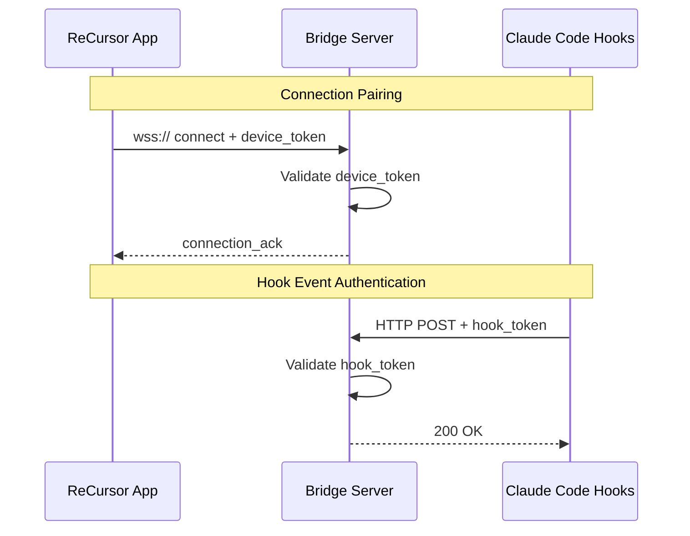

# Security Architecture

> Best practices for securing the WebSocket bridge between the ReCursor mobile app and the coding agent.

---

## Network Layer

- **Use a secure tunnel for remote access.** Tailscale (recommended) wraps WireGuard encryption, handles NAT traversal, and creates a zero-config mesh VPN between phone and dev machine. DERP relay servers never see unencrypted data. Other options include WireGuard, Cloudflare Tunnel, or SSH tunneling.
- **Always use `wss://` (WebSocket Secure).** TLS at the application layer + tunnel encryption at the network layer = defense in depth.
- **Never expose the bridge on a public IP without tunnel protection.** The bridge should only be reachable within your secure tunnel network.

---

## Bridge Connection Security



### Token Types

| Token Type | Purpose | Storage |
|------------|---------|---------|
| Device Pairing Token | Authenticate mobile app to bridge (generated at pairing) | `flutter_secure_storage` |
| Hook Token | Authenticate Claude Code Hooks to bridge | Bridge server env only |

---

## Token Management

### Device Pairing Token

- **Generate**: 32+ character random string (crypto-safe), generated during bridge setup
- **Storage**: Bridge server environment variable or config file
- **Mobile**: Encrypted with `flutter_secure_storage` (Keychain/EncryptedSharedPreferences)
- **QR Code**: Bridge URL + token encoded for easy pairing
- **No User Accounts**: Tokens are per-device, not tied to any user identity or hosted account
- **Bridge-First**: No login flow — the app opens to bridge pairing/restore, not sign-in

```dart
// Token generation (bridge server)
import crypto from 'crypto';
const token = crypto.randomBytes(32).toString('hex'); // 64 chars
```

### Token Rotation

- Rotate device tokens if bridge is reinstalled or security concern arises
- Clear token from mobile app via "Disconnect Bridge" in Settings
- Support token revocation list on bridge server

---

## Certificate Pinning

Flutter supports SSL pinning via `SecurityContext` with certificate chain files from assets.

```dart
// Certificate pinning setup
Future<SecurityContext> getSecureContext() async {
  final context = SecurityContext(withTrustedRoots: false);
  
  // Load pinned certificate
  final cert = await rootBundle.load('assets/certs/bridge.crt');
  context.setTrustedCertificatesBytes(cert.buffer.asUint8List());
  
  return context;
}

// Use with WebSocket
final channel = IOWebSocketChannel.connect(
  'wss://100.78.42.15:3000',
  customClient: HttpClient(context: await getSecureContext()),
);
```

**Pin the public key**, not the certificate itself — more resilient to cert renewals.

Maintain backup pins per OWASP guidance to prevent app breakage.

---

## Bridge Authorization

The bridge server is the security boundary — it must enforce its own authorization layer.

- **Allowlist of permitted operations** (e.g., file read yes, `rm -rf /` no)
- **Enforce working directory boundaries** — the agent should only access the project directory
- **Log all commands** sent through the bridge for audit
- **Separate bridge auth from agent auth** — compromising one shouldn't compromise the other

### Working Directory Isolation

```typescript
// Bridge server authorization
function validateWorkingDirectory(
  requestedPath: string,
  allowedRoot: string
): boolean {
  const resolved = path.resolve(requestedPath);
  const root = path.resolve(allowedRoot);
  return resolved.startsWith(root);
}
```

### Operation Allowlist

```typescript
const ALLOWED_TOOLS = [
  'read_file',
  'edit_file',
  'glob',
  'grep',
  'ls',
];

const BLOCKED_COMMANDS = [
  'rm -rf /',
  'sudo',
  'chmod 777',
];
```

---

## Data in Transit

- All WebSocket messages should be JSON with a defined schema
- Sensitive data (tokens, keys found in code) should be flagged and optionally redacted in transit
- Consider message signing (HMAC) for critical operations (git push, file delete) as an additional integrity check

### Payload Sanitization

```typescript
// Redact sensitive patterns from responses
function sanitizePayload(payload: unknown): unknown {
  const sensitivePatterns = [
    /[a-zA-Z0-9_-]{20,}\.[_a-zA-Z0-9]{10,}/g, // API keys
    /ghp_[a-zA-Z0-9]{36}/g, // GitHub tokens
    /sk-[a-zA-Z0-9]{48}/g, // Anthropic keys
  ];
  
  const json = JSON.stringify(payload);
  let sanitized = json;
  
  for (const pattern of sensitivePatterns) {
    sanitized = sanitized.replace(pattern, '[REDACTED]');
  }
  
  return JSON.parse(sanitized);
}
```

---

## Claude Code Hooks Security

### Hook Endpoint Authentication

```typescript
// Bridge server hook endpoint
app.post('/hooks/event', (req, res) => {
  const token = req.headers.authorization?.replace('Bearer ', '');
  
  if (!verifyHookToken(token)) {
    return res.status(401).json({ error: 'Unauthorized' });
  }
  
  // Process event
});
```

### Event Validation

```typescript
function validateHookEvent(event: unknown): boolean {
  // Validate structure
  // Validate timestamp (not too old)
  // Validate signature (if using HMAC)
  return true;
}
```

---

## Security Checklist

### Development

- [ ] Never commit secrets to repository
- [ ] Use `.env` files for local configuration (not committed)
- [ ] Run `flutter analyze` security lints
- [ ] Use Snyk or similar for dependency scanning

### Deployment

- [ ] Generate unique bridge auth tokens per user/device
- [ ] Enable TLS 1.3 on bridge server
- [ ] Configure Tailscale ACLs (access control lists)
- [ ] Set up intrusion detection on bridge server
- [ ] Enable audit logging

### Mobile App

- [ ] Use `flutter_secure_storage` for all tokens
- [ ] Implement certificate pinning
- [ ] Support biometric unlock for sensitive operations
- [ ] Clear sensitive data on app background

---

## Threat Model

| Threat | Likelihood | Impact | Mitigation |
|--------|------------|--------|------------|
| Token theft | Medium | High | Secure storage, rotation, short expiry |
| Man-in-the-middle | Low | High | TLS + certificate pinning |
| Bridge compromise | Low | Critical | Working directory isolation, operation allowlist |
| Replay attacks | Low | Medium | Timestamp validation, nonce |
| Social engineering | Medium | Medium | Out-of-band confirmation for destructive ops |

---

## Related Documentation

- [Architecture Overview](architecture/overview.md) — System architecture
- [Bridge Protocol](bridge-protocol.md) — WebSocket specification
- [Claude Code Hooks Integration](integration/claude-code-hooks.md) — Hook security
- [Agent SDK Integration](integration/agent-sdk.md) — Agent SDK security

---

*Last updated: 2026-03-17*
