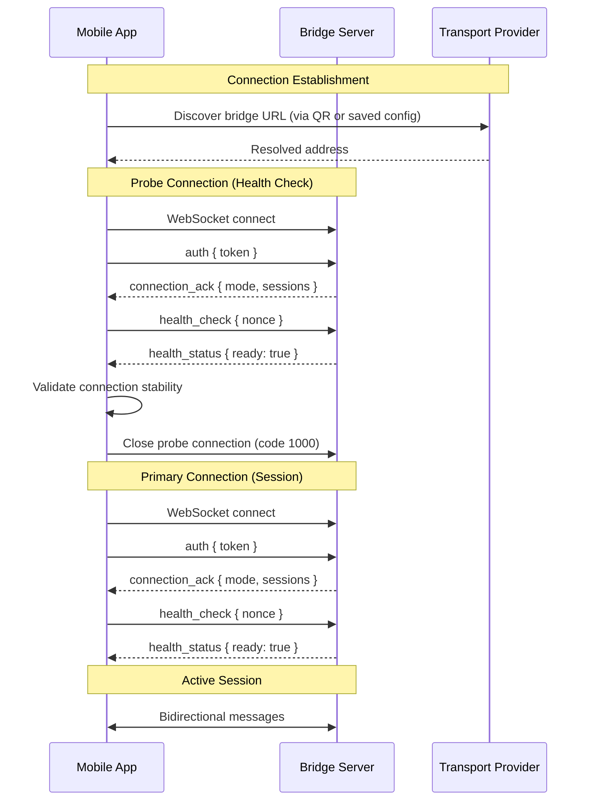

# Transport Provider Specification

> Transport provider behavior, stability characteristics, and protocol expectations for connecting the ReCursor mobile app to the bridge server.

---

## Overview

ReCursor supports multiple transport providers to expose the bridge server for remote mobile access. Each provider has distinct stability, reliability, and configuration characteristics that impact connection behavior.

**Transport Priority (Recommended):**

| Priority | Provider | Stability | Use Case |
|----------|----------|-----------|----------|
| 1 | **Tailscale** | ✅ Production | Zero-config mesh VPN, recommended default |
| 2 | **Named Cloudflare Tunnel** | ✅ Production | Persistent domain, stable URLs |
| 3 | **Ngrok** | ⚠️ Development | Temporary URLs, rate limits |
| 4 | **Manual** | ⚠️ Development | Local network only, requires manual IP |
| 5 | **Cloudflare Quick Tunnel** | ❌ Experimental | No uptime guarantee, URL changes each restart |

---

## Connection Lifecycle

### Probe vs Primary Connection Semantics

The mobile app establishes WebSocket connections with specific purpose semantics:



#### Connection Purpose Types

| Purpose | Duration | Behavior | Code |
|---------|----------|----------|------|
| **Probe** | ~500ms - 2s | Health verification, mode detection, capability check | Establish → Health Check → Close (1000) |
| **Primary** | Session lifetime | Active session for all real-time communication | Establish → Health Check → Keep alive |

**Implementation Notes:**
- Probe connections MUST close cleanly after health verification (code 1000 normal close)
- Primary connections SHOULD reuse the same WebSocket for the entire session
- Rapid connect/disconnect cycles (code 1005) indicate transport instability or protocol errors
- The bridge logs distinguish between expected probe closures and unexpected disconnects

---

## Transport Providers

### Tailscale (Recommended)

**Stability:** ✅ Production-ready
**URL Pattern:** `wss://<hostname>.tailnet.ts.net:<port>` or `wss://100.x.x.x:<port>`
**Connection Mode:** `secure_remote`

**Characteristics:**
- Persistent URLs (hostname-based or IP-based within tailnet)
- WireGuard encryption at network layer
- DERP relay servers for NAT traversal (never see unencrypted data)
- Zero configuration after initial `tailscale up`

**Configuration:**
```bash
recursor setup --transport=tailscale
```

**Health Indicators:**
- ✅ URL remains stable across restarts
- ✅ Tailscale IP addresses validated as `secure_remote`
- ✅ DERP relay provides reliable NAT traversal
- ⚠️ Requires Tailscale daemon running on bridge host

---

### Named Cloudflare Tunnel

**Stability:** ✅ Production-ready (with account)
**URL Pattern:** `wss://<configured-hostname>.<domain>:443`
**Connection Mode:** `secure_remote`

**Characteristics:**
- Persistent URLs tied to Cloudflare account
- Requires a pre-created named tunnel and runtime launch via `cloudflared tunnel run <tunnel-name>`
- ReCursor stores the configured public HTTPS hostname and existing tunnel name; it does **not** create tunnels or DNS routes for you
- TLS termination at Cloudflare edge
- IP addresses from Cloudflare edge classified as `secure_remote`

**Configuration:**
```bash
# Create named tunnel (one-time setup)
cloudflared tunnel create recursor-bridge

# Route hostname to tunnel
cloudflared tunnel route dns recursor-bridge bridge.yourdomain.com

# Configure ReCursor with the public hostname
recursor setup --transport=cloudflare --public-url=https://bridge.yourdomain.com

# During setup, provide the existing tunnel name when prompted
```

**Health Indicators:**
- ✅ URL remains stable across restarts
- ✅ Validated as `secure_remote` via Cloudflare certificate
- ⚠️ Requires Cloudflare account and domain
- ⚠️ Cloudflare sees TLS-terminated traffic (edge proxy)

---

### Cloudflare Quick Tunnel (Experimental)

**Stability:** ❌ Experimental — NOT production-ready
**URL Pattern:** `wss://<random-subdomain>.trycloudflare.com`
**Connection Mode:** `direct_public`

> ⚠️ **Warning:** Quick Tunnels have **no uptime guarantee**. URLs change on every restart. Connections may disconnect without warning. Cloudflare reserves the right to investigate usage for terms violations. Intended for quick experimentation only.

**Characteristics:**
- Ephemeral URLs generated at runtime (different each restart)
- No account required (`cloudflared tunnel --url http://localhost:PORT`)
- Random subdomain on `trycloudflare.com`
- **Classified as `direct_public`** (public IP, no tunnel identity validation)

**Known Issues:**

| Issue | Symptom | Impact |
|-------|---------|--------|
| URL changes each restart | QR code invalid after restart | Requires re-pairing on every start |
| No uptime guarantee | Random disconnections | WebSocket drops (code 1005) |
| Terms of Service review | Potential service denial | Production use prohibited |
| No persistence | Connection state lost on restart | No graceful reconnection |

**Configuration:**
```bash
recursor setup --transport=cloudflare
```

**When Quick Tunnel is Auto-Selected:**
This occurs when `cloudflared` is detected on PATH but no account/tunnel is configured. The CLI defaults to Quick Tunnel mode.

**Migration Path:**
To use Cloudflare for production, migrate to Named Tunnels:
1. Create a Cloudflare account
2. Create a named tunnel: `cloudflared tunnel create recursor-bridge`
3. Route a hostname: `cloudflared tunnel route dns recursor-bridge bridge.example.com`
4. Run `recursor setup --transport=cloudflare --public-url=https://bridge.example.com` and provide the existing tunnel name when prompted

---

### Ngrok

**Stability:** ⚠️ Development use only
**URL Pattern:** `wss://<random-subdomain>.ngrok-free.app`
**Connection Mode:** `direct_public`

**Characteristics:**
- Free tier generates random URLs (change each restart)
- Paid tier supports persistent subdomains
- Rate limits on free tier
- TLS termination at ngrok edge

**Known Issues:**
- URL changes each restart (free tier)
- Rate limiting may disconnect long sessions
- Connection mode classified as `direct_public`

---

### Manual (Local Network)

**Stability:** ⚠️ Development use only
**URL Pattern:** `wss://<local-ip>:<port>` or `http://127.0.0.1:<port>`
**Connection Mode:** `local_only` or `private_network`

**Characteristics:**
- Direct connection to local IP address
- No tunnel infrastructure required
- Limited to local network access
- **Not suitable for remote mobile access**

**Configuration:**
```bash
recursor setup --transport=manual --port=3443
```

---

## Connection Mode Detection

The bridge classifies incoming connections into modes based on the transport provider:

| Mode | Detection Criteria | Transport Provider |
|------|-------------------|-------------------|
| `local_only` | `127.0.0.1`, `::1` | Manual (localhost) |
| `private_network` | RFC1918 (10.x, 172.16-31.x, 192.168.x) | Manual (LAN) |
| `secure_remote` | Tailscale IP (100.x.x.x), WireGuard, Named Cloudflare, Verified TLS domain | Tailscale, Named Cloudflare |
| `direct_public` | Public IP or domain without tunnel validation | Quick Tunnel, Ngrok, Manual (public) |
| `misconfigured` | `ws://` instead of `wss://`, invalid TLS | Any |

### Transport-Specific Mode Detection

**Tailscale IPs (100.x.x.x):**
```typescript
function isTailscaleIP(ip: string): boolean {
  return ip.startsWith('100.');
}
// Classified as: secure_remote
```

**Cloudflare Edge IPs:**
Quick Tunnel connections originate from Cloudflare edge servers (e.g., `216.247.15.107`). These IPs are **not** validated as secure_remote because:
- Quick Tunnel provides no identity verification
- URLs are ephemeral and can be intercepted
- Terms prohibit production use

**Named Cloudflare Tunnel:**
Connection URLs match configured hostname (e.g., `bridge.yourdomain.com`). TLS certificate validates the domain, classifying as `secure_remote`.

```typescript
function isCloudflareNamedTunnel(hostname: string): boolean {
  // Named tunnel uses user's own domain
  return isUserDomain(hostname) && hasValidTLS(hostname);
}
```

---

## Protocol Selection Expectations

### Transport Protocol Stack

```
┌─────────────────────────────────────────────────────────────┐
│ Application Layer: WebSocket (wss://)                      │
├─────────────────────────────────────────────────────────────┤
│ Transport Layer: TLS 1.3 (Required)                        │
├─────────────────────────────────────────────────────────────┤
│ Network Layer: Tunnel/VPN (Recommended)                     │
│  - Tailscale: WireGuard mesh VPN                            │
│  - Cloudflare: QUIC to edge, HTTP/2 to origin               │
│  - Ngrok: HTTP/2 tunnel                                     │
│  - Manual: Direct TCP/IP                                    │
└─────────────────────────────────────────────────────────────┘
```

### Required vs Recommended

| Layer | Requirement | Notes |
|-------|-------------|-------|
| **TLS (wss://)** | Required | Unencrypted `ws://` is blocked |
| **Tunnel/VPN** | Recommended | Direct public connections require acknowledgment |
| **Device Pairing Token** | Required | Application-layer authentication |

### Health Verification Sequence

1. **Transport Connect**: WebSocket connection established
2. **Auth Message**: Device pairing token validated
3. **Connection ACK**: Server returns detected connection mode
4. **Health Check**: Client sends nonce, server validates clock/latency
5. **Health Status**: Server confirms ready state or warns
6. **Acknowledgment** (if `direct_public`): Explicit user confirmation required

---

## Stability Mitigation Strategies

### For Unstable Transports (Quick Tunnel, Ngrok Free)

When using experimental or development-grade transports:

1. **Reconnection Backoff**: Exponential backoff with jitter
   ```typescript
   const BACKOFF_DELAYS = [1000, 2000, 5000, 10000, 30000];
   ```

2. **Session Persistence**: Bridge maintains replay buffer for disconnected clients
   ```typescript
   const SESSION_GRACE_MS = 5 * 60 * 1000; // 5 minutes
   ```

3. **Offline Queue**: Mobile app queues messages when disconnected
   ```dart
   // Messages queued locally during disconnect
   // Synced on reconnect with replay buffer
   ```

4. **URL Rotation Detection**: Mobile app detects when saved URL is stale
   ```dart
   // On health_check timeout: prompt for re-pairing
   ```

5. **Connection Pooling**: Avoid rapid probe-primary cycles
   ```dart
   // Probe connection closes BEFORE primary opens
   // Not simultaneously (causes code 1005 on unstable transports)
   ```

### Recommended Production Configuration

```bash
# Tailscale (recommended)
recursor setup --transport=tailscale

# Or Named Cloudflare Tunnel (alternative)
cloudflared tunnel create recursor-bridge
cloudflared tunnel route dns recursor-bridge bridge.yourdomain.com
recursor setup --transport=cloudflare --public-url=https://bridge.yourdomain.com
# During setup, provide the existing tunnel name when prompted
```

---

## Open Questions

| Question | Status | Notes |
|----------|--------|-------|
| Should bridge auto-detect transport type? | Open | Could check for Tailscale IP vs Cloudflare edge IP |
| Named Tunnel support in CLI? | ✅ Implemented | Named tunnels configured via `--public-url` with tunnel name prompted during setup |
| Connection mode UI indicator? | Planned | Mobile app UI to show connection security level |

---

## Related Documentation

- [Bridge Protocol](bridge-protocol.md) — WebSocket message specification
- [Security Architecture](security-architecture.md) — Connection mode security details
- [Error Handling](error-handling.md) — Reconnection strategies
- [Architecture Overview](architecture/overview.md) — System components

---

*Last updated: 2026-03-21*